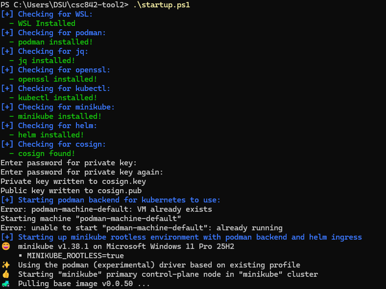

# csc842-tool2
This is a script to automate setup of secure software supply chain.

## Problem
Getting a toolchain setup to learn and test a fully secured software supply chain is difficult with so many tools and so many security postures to consider. There is SLSA and SBOMs, provenance and attestation, SAST/DAST/SCA, system monitoring and all of the dashboards that go along with it. A system like this needs good testing and good startup resources to allow a learner to try things out in a low-risk setting.

### Existing Tools
While there are a few tools online, there is very little in the way of localized setup and testing, especially on the Windows OS.

### Why Care?
If a security practitioner cannot easily test and de-risk answers, then implementation will be far less likely with fewer implementers who really understand the whole lifecycle.

### Intent
This tool intended to setup both a secure starting environment for a kubernetes-driven local platform that was provably secure via attestations and secure initial containers for GitLab, Artifactory, and Chainguard with additional tutorials to walk through secure setup of pipelines with hello-world type repos for one or two common languages like python and C.

However, getting the initial attestations implemented proved harder than expected. The resulting product simply installs tools and a Kubernetes environment where helm charts can be pulled in on a Windows 11 OS.

## Design
The design of this "product" was to be a single script to setup the environment in Windows and accompanying tutorials to walkthrough a few open-source tools to accomplish SBOM verification and product attestation within this provably secure environment.

This iteration only implements the initial environment of Kubernetes with a simple SigStore that I could not get to work in a localized environment. I have not worked to the root of this problem yet, but I suspect it is something to do with the lack of an SSL certificate.

## Evaluation
My primary evaluation came in installing a few prerequisites and running the install script. The script is not the most robust for installation, but it attempts to make sure that existing tools are not overwritten.

## Prerequisites
You will need a Windows 11 machine with the following:
* WSL installed
* Powershell 5 running as Administrator
* `Set-ExecutionPolicy RemoteSigned -Scope CurrentUser` in the admin shell.

## Installation & Usage
When your environment is setup as described in Prerequisites, just run `startup.ps1` from this repo. 

After this, you *should* be able to follow the tutorial at https://edu.chainguard.dev/open-source/sigstore/policy-controller/how-to-install-policy-controller/#step-4--defining-a-clusterimagepolicy to verify that your Kubernetes installation is respecting your attestation requirements.

Currently, this may not be possible because I am getting an error in the helm install script but this worked earlier in the week.

The output should be something like the following:

